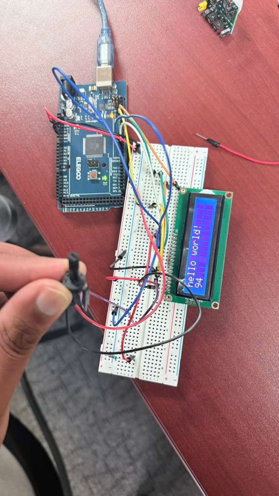

# Basic LCD Display

## Description
This project demonstrates how to interface a standard 16x2 LCD display with an Arduino Uno R3. It utilizes the standard Arduino `LiquidCrystal` library. The provided sketch displays a static "hello world!" message on the first line and a running counter (seconds since reset) on the second line.

## Components Required
* 1x Arduino Uno R3
* 1x LCD 16 x 2
* 1x 10 kΩ Potentiometer (for contrast control)
* 1x 220 Ω Resistor (for LCD backlight)

## Circuit Connections
Connect your LCD to the Arduino using the following pin mapping:

* **LCD RS** pin to digital pin **12**
* **LCD Enable** pin to digital pin **11**
* **LCD D4** pin to digital pin **5**
* **LCD D5** pin to digital pin **4**
* **LCD D6** pin to digital pin **3**
* **LCD D7** pin to digital pin **2**
* **LCD R/W** pin to **Ground**
* **LCD VSS** pin to **Ground**
* **LCD VCC** pin to **5V**
* **10K Potentiometer**: 
  * Ends connect to +5V and Ground.
  * The middle wiper connects to the **LCD VO** pin (pin 3) to adjust contrast.

*(Refer to the included `Basic_LCD_Display.png` and `Basic_LCD_Display.pdf` for visual wiring diagrams.)*

## Included Files
* `Basic_LCD.ino`: The main Arduino C++ sketch.
* `Basic_LCD_Display.csv`: A Bill of Materials (BOM) listing the required components.
* `Basic_LCD_Display.pdf`: PDF documentation/circuit diagram for the project.
* `Basic_LCD_Display.png`: Visual layout of the breadboard connections.
* `Readme.md`: This documentation file.

## Steps to Run
1. **Build the Circuit**: Follow the pinout listed above or use the provided `.png` schematic to connect the LCD, Potentiometer, and Resistor to your Arduino Uno.
2. **Connect the Arduino**: Plug the Arduino Uno into your computer using a USB cable.
3. **Open the Code**: Open the `Basic_LCD.ino` file using the Arduino IDE.
4. **Configure IDE**: Go to `Tools > Board` and select **Arduino Uno**. Go to `Tools > Port` and select the appropriate COM port for your Arduino.
5. **Upload**: Click the **Upload** button to compile and upload the sketch to the Arduino board.
6. **Adjust Contrast**: If the display is blank or completely filled with white blocks, use a small screwdriver to turn the 10 kΩ Potentiometer until the "hello world!" text becomes clearly visible.

## Demonstration
Here is the working project in action:

*See the included `Basic_LCD_Display_Working_Images/Basic_LCD_Display_Working.mp4` video for a live demonstration of the counting sequence.*
