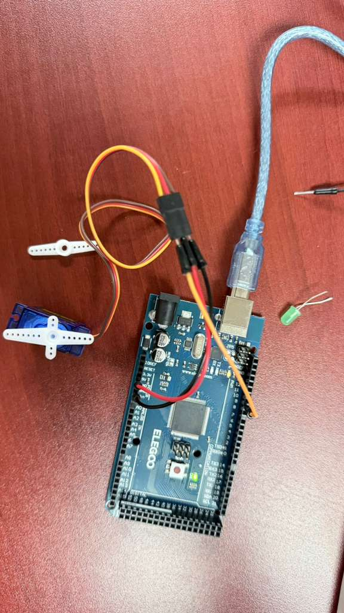

# Basic Servo Sweep

## Description
This project demonstrates how to control a standard Positional Micro Servo using an Arduino Uno R3. It utilizes the standard Arduino `Servo` library. The provided sketch performs a continuous "sweep", moving the servo horn from 0 degrees to 180 degrees and then back down to 0 degrees in 1-degree increments.

## Components Required
* 1x Arduino Uno R3
* 1x Positional Micro Servo

## Circuit Connections
Connect your servo to the Arduino using the following standard pin mapping. *(Note: Wire colors vary by servo manufacturer, but common color schemes are listed below)*:

* **Servo Power (Red or Center wire)** to **5V**
* **Servo Ground (Brown or Black wire)** to **Ground**
* **Servo Signal (Yellow, Orange, or White wire)** to digital pin **9**

*(Refer to the included `Basic_Servo.png` and `Basic_Servo.pdf` for visual wiring diagrams.)*

## Included Files
* `Basic_Servo.ino`: The main Arduino C++ sketch.
* `Basic_Servo.csv`: A Bill of Materials (BOM) listing the required components.
* `Basic_Servo.pdf`: PDF documentation/circuit diagram for the project.
* `Basic_Servo.png`: Visual layout of the breadboard connections.
* `Basic_Servo_Working_Images/`: Directory containing a video and a picture of the working circuit.
* `Readme.md`: This documentation file.

## Steps to Run
1. **Build the Circuit**: Connect the Servo's Power, Ground, and Signal wires to the Arduino Uno as listed above.
2. **Connect the Arduino**: Plug the Arduino Uno into your computer using a USB cable.
3. **Open the Code**: Open the `Basic_Servo.ino` file using the Arduino IDE.
4. **Configure IDE**: Go to `Tools > Board` and select **Arduino Uno**. Go to `Tools > Port` and select the appropriate COM port for your Arduino.
5. **Upload**: Click the **Upload** button to compile and upload the sketch to the Arduino board. The servo should immediately begin sweeping back and forth.

## Demonstration
Here is the working project in action:

*See the included `Basic_Servo_Working_Images/Basic_Servo_Working.mp4` video for a live demonstration of the servo sweep motion.*
