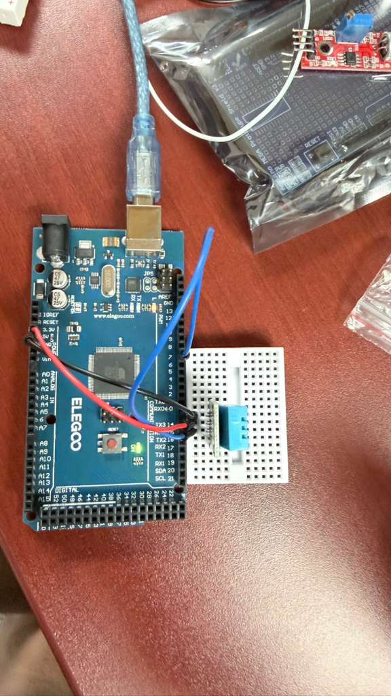
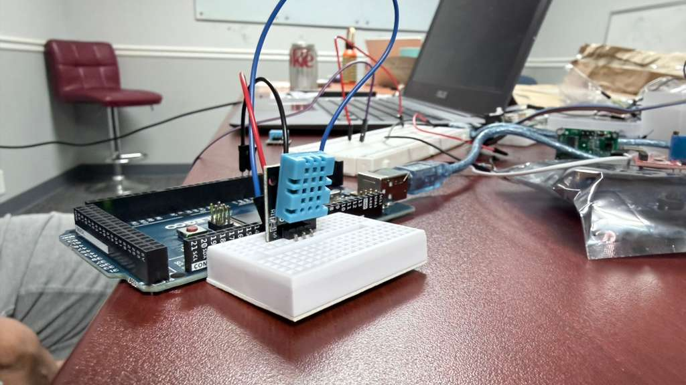

# Basic Temperature and Humidity Monitor

## Description
This project demonstrates how to interface a DHT11 Temperature and Humidity sensor with an Arduino Uno. The provided sketch reads both the temperature and humidity values from the sensor using a custom DHT library and prints the data to the Serial Monitor.

## Components Required
* 1x Arduino Uno R3
* 1x DHT11 Temperature and Humidity Sensor (can be a 3-pin module or a 4-pin standalone sensor)
* *(Optional)* 1x 10kΩ Resistor (required as a pull-up if you are using the bare 4-pin sensor without a breakout board)

## Circuit Connections
Connect your DHT11 sensor to the Arduino using the following pin mapping. Depending on whether you have the 3-pin or 4-pin version of the DHT11, reference the corresponding diagram included in this folder (`Arduino-DHT11-3-Pin.avif` or `Arduino-DHT11--4-Pin.avif`):

* **VCC (+) Pin** to **5V**
* **GND (-) Pin** to **Ground**
* **Data (OUT/S) Pin** to digital pin **7**

*(If using a standalone 4-pin DHT11, connect the 10kΩ resistor between the Data pin and VCC. Leave the 3rd pin unconnected.)*

## Included Files
* `Basic_Temperature.ino`: The main Arduino C++ sketch.
* `DHTLib.zip`: A library dependency needed to compile the code.
* `Arduino-DHT11-3-Pin.avif`: Connection diagram for the 3-pin DHT11 module.
* `Arduino-DHT11--4-Pin.avif`: Connection diagram for the 4-pin standalone DHT11 sensor.
* `DHT11.avif`: Picture of the sensor.
* `Basic_Temperature_Working_Images/`: Directory containing demonstration photos and video.
* `Readme.md`: This documentation file.

## Steps to Run
1. **Install the Library**: Open the Arduino IDE. Go to `Sketch > Include Library > Add .ZIP Library...` and select the included `DHTLib.zip` file to install it.
2. **Build the Circuit**: Connect the DHT11's Power, Ground, and Data pins to the Arduino Uno as listed above (Data goes to Pin 7).
3. **Connect the Arduino**: Plug the Arduino Uno into your computer using a USB cable.
4. **Open the Code**: Open the `Basic_Temperature.ino` file using the Arduino IDE.
5. **Configure IDE**: Go to `Tools > Board` and select **Arduino Uno**. Go to `Tools > Port` and select the appropriate COM port for your Arduino.
6. **Upload**: Click the **Upload** button to compile and upload the sketch to the Arduino board.
7. **View the Output**: Open the **Serial Monitor** (`Tools > Serial Monitor`) and set the baud rate to **9600**. You should see temperature and humidity values printing every second.

## Demonstration
Here is the working project in action:

### Working Setup

### Serial Monitor Output
*See the included `Basic_Temperature_Working_Images/Basic_Temperature_Output.mp4` video for a live demonstration of the Serial Monitor output.*
