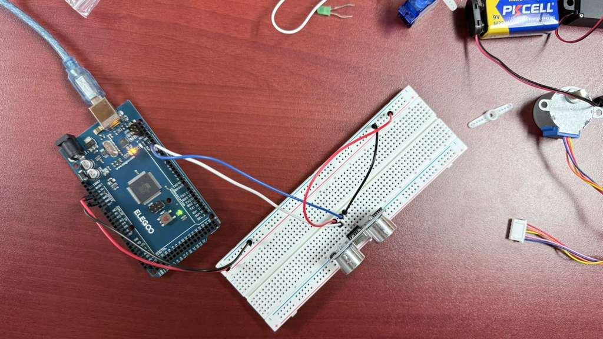
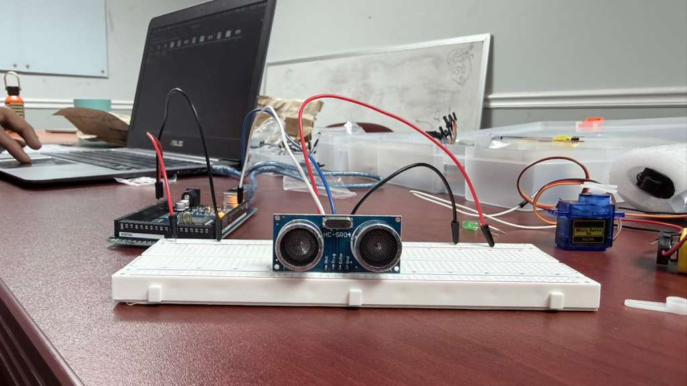

# Basic Ultrasonic Distance Sensor

## Description
This project demonstrates how to interface an Ultrasonic Distance Sensor (such as the common HC-SR04) with an Arduino Uno R3. The provided sketch triggers the sensor to emit an ultrasonic pulse, measures the time it takes for the echo to return, and calculates the distance in centimeters. The resulting distance is then printed to the Serial Monitor.

## Components Required
* 1x Arduino Uno R3
* 1x Ultrasonic Distance Sensor (e.g., HC-SR04)

## Circuit Connections
Connect your Ultrasonic sensor to the Arduino using the following pin mapping:

* **VCC Pin** to **5V**
* **Trig (Trigger) Pin** to digital pin **9**
* **Echo Pin** to digital pin **10**
* **GND Pin** to **Ground**

*(Refer to the included `Basic_Ultrasonic.png` and `Basic_Ultrasonic.pdf` for visual wiring diagrams.)*

## Included Files
* `Basic_UltraSonic.ino`: The main Arduino C++ sketch.
* `Basic_Ultrasonic.csv`: A Bill of Materials (BOM) listing the required components.
* `Basic_Ultrasonic.pdf`: PDF documentation/circuit diagram for the project.
* `Basic_Ultrasonic.png`: Visual layout of the breadboard connections.
* `Basic_UltraSonic_Working_Images/`: Directory containing demonstration photos and video of the sensor in action.
* `Readme.md`: This documentation file.

## Steps to Run
1. **Build the Circuit**: Connect the VCC, Trig, Echo, and GND pins of the Ultrasonic sensor to the Arduino Uno as listed above.
2. **Connect the Arduino**: Plug the Arduino Uno into your computer using a USB cable.
3. **Open the Code**: Open the `Basic_UltraSonic.ino` file using the Arduino IDE.
4. **Configure IDE**: Go to `Tools > Board` and select **Arduino Uno**. Go to `Tools > Port` and select the appropriate COM port for your Arduino.
5. **Upload**: Click the **Upload** button to compile and upload the sketch to the Arduino board.
6. **View the Output**: Open the **Serial Monitor** (`Tools > Serial Monitor`) and set the baud rate to **9600**. You should see the distance measurements (in cm) printing every 500 milliseconds. Try placing your hand in front of the sensor to see the distance change!

## Demonstration
Here is the working project in action:

### Working Setup

### Serial Monitor Output
*See the included `Basic_UltraSonic_Working_Images/Basic_Ultrasonic_Output.mp4` video for a live demonstration of the distance measurements printing to the Serial Monitor.*
