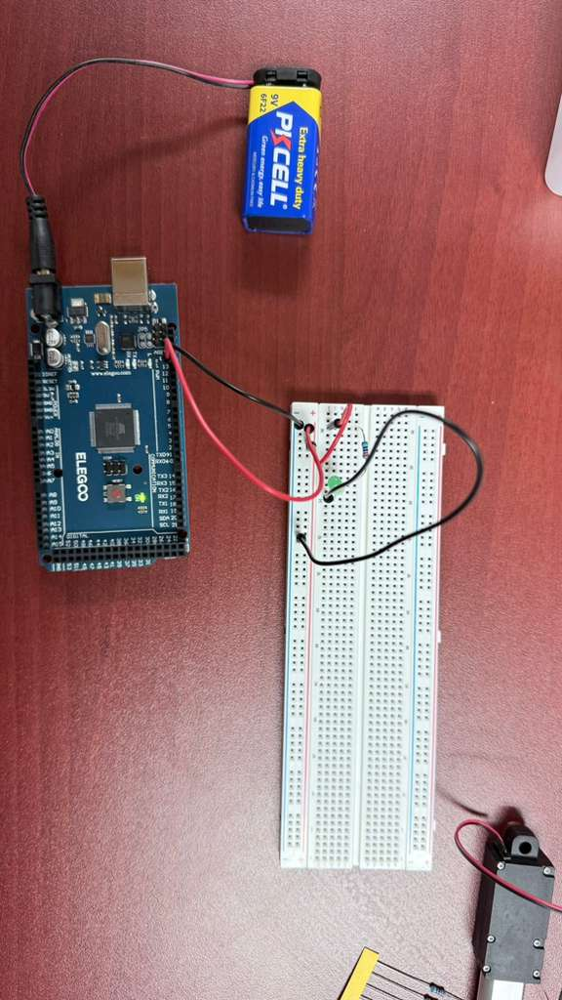
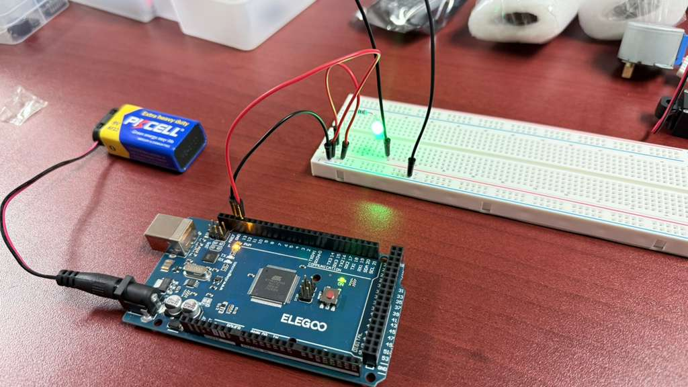

# Blinking LED

## Description
This project is the classic "Hello World" of hardware: the Blinking LED. The provided sketch turns an LED on for one second and then off for one second, continuously. It utilizes the `LED_BUILTIN` macro, which targets digital pin 13 on the Arduino Uno. While the Arduino has a tiny built-in LED on this pin, this project also demonstrates how to wire an external LED in series with a current-limiting resistor to the same pin for a brighter, more visible effect.

## Components Required
* 1x Arduino Uno R3
* 1x Red LED (or any color of your choice)
* 1x 220 Ω Resistor (to prevent the LED from drawing too much current)

## Circuit Connections
Connect your external LED and resistor to the Arduino as follows:

* **LED Anode (Long Leg)** to digital pin **13**
* **LED Cathode (Short Leg)** to one end of the **220 Ω Resistor**
* The other end of the **220 Ω Resistor** to **Ground (GND)**

*(Note: The resistor can be placed on either the Anode or Cathode side of the LED. Refer to the included `Basic_LED.png` and `Basic LED.pdf` for visual wiring diagrams.)*

## Included Files
* `Blinking_LED.ino`: The main Arduino C++ sketch.
* `Basic_LED.csv`: A Bill of Materials (BOM) listing the required components.
* `Basic LED.pdf`: PDF documentation/circuit diagram for the project.
* `Basic_LED.png`: Visual layout of the breadboard connections.
* `Blinking_LED_Working_Images/`: Directory containing demonstration photos and a video of the blinking LED.
* `Readme.md`: This documentation file.

## Steps to Run
1. **Build the Circuit**: Connect the LED and the 220 Ω resistor to Pin 13 and Ground on the Arduino Uno, as described above.
2. **Connect the Arduino**: Plug the Arduino Uno into your computer using a USB cable.
3. **Open the Code**: Open the `Blinking_LED.ino` file using the Arduino IDE.
4. **Configure IDE**: Go to `Tools > Board` and select **Arduino Uno**. Go to `Tools > Port` and select the appropriate COM port for your Arduino.
5. **Upload**: Click the **Upload** button to compile and upload the sketch to the Arduino board. The built-in LED and your external red LED should immediately start blinking on and off every second.

## Demonstration
Here is the working project in action:

### Working Setup

### Video Demonstration
*See the included `Blinking_LED_Working_Images/Blinking_LED_Working.mp4` video for a live demonstration of the 1-second blink interval.*
